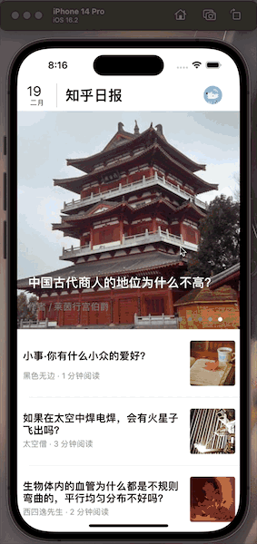
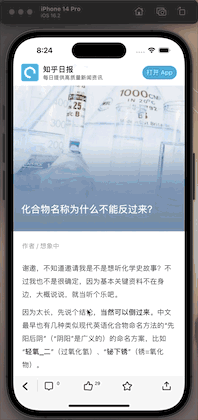

# 一.APP简要介绍

## 1.主页面

- 顶部可显示当日日期

- 可显示当日及过往五日的重点新闻（轮播图视图），并可点击查看新闻详情。



- 可显示今日新闻的六条新闻并点击查看详情（未完成过往新闻的编写）。

## 2.新闻详情页

- 可实现点击返回主页面，点赞并出现提示且点赞数加1，收藏并出现提示，评论和分享的点击反馈




# 二.app构成板块和开发思路

## 1.总体

- 包含多个页面的转换，因此把Window的rootViewController设置为UINavigationController，用于链接各个页面

## 2.主页面

- 顶部的UIView 
- 主界面的UITableView，包含一个自定义的UICollectionView和6个UITableViewCell

## 3.新闻详情页

- 隐藏顶部的UINavigationBar
- 包含一个主要的WKWebView和底部的一个人自定义的UIView，包含若干小控件

# 三.使用的比较重要的技术以及知识点

## 1.实现轮播图加UITableView 的效果

我刚开始的思路是简单的用一个UICollectionView和UITableView，但这样无法实现轮播图也会被向上滑动的效果。然后我的思路是仅用一个UITableView，在UITableView的顶端加上一个UICollectionView，关键点在于如何把它放在cell的上面。此处我用的是

```objective-c
  _table.contentInset = UIEdgeInsetsMake(385, 0, 0, 0);
```

在UITableView上拓出一个空间。

此外，如果直接在该空间上加载一个UICollectionView将无法实现，因此需要在该空间上加载一个自定义的UIView，然后在这个自定义的View中在加载出一个UICollectionVIew。但此处出现了一个巨大问题，由于在ViewController中仅加载的是一个TableView，在TableView中再加载一个UIView，而在这个UIView中的UICollectionView的代理方法只能写在UIView中，因此这里出现了Model 和View连接的情况，但目前我无法解决，只能这样。（原则上Model 和View 仅能和VC 链接）

## 2. 主界面的轮播图自动滑动

通过一个NSTimer类进行时间控制，以达到自动翻页，并且在一个自定义的翻页的方法中限定当当前页面为最后一页时，下一页面为第一个页面。

# 四.心得体会

## 1. 一定要先构思，描绘一个大体的框架

在一开始的时候我直接在原始的VC中写主界面的内容。导致当我发现还要和其他界面进行链接的时候遇到了很多问题，因此又重新编写了一个MainPageViewController，并重新设置rootVC。

## 2. 当需要用新的知识去编写的时候一定要先进行充足的学习，再开始动手。

当我第一次开始使用UINavigationController的时候，仅搜索了几篇博客就开始写，结果导致明明我和博客中做的事一模一样的操作，缺始终出现各种奇怪的BUG，并在这里卡了很久。最后找到了一个视频讲解，才发现，我之前看的所有博客都没有讲关于rootVC 的设置问题，导致我直接在VC中写NavigationController，以至于一个简单的问题耽误了很久的时间。

## 3.进行合理的时间管理

这个作品中个人界面以及相关的伪登陆等功能都因为最后时间的不够而没能完成。

## 4.继续坚持不懈的学习

这个项目中我最大的遗憾就是没有完成往日新闻的编写，因为 始终没有理清关于无限向下刷新出往日新闻这样一个效果的MVC逻辑关系和实际编写的操作细节。导致这样的一个重要功能没有完成。因此我应该继续加强学习，通过学习更多，更难的知识来解决未来可能遇到的各种难题。
